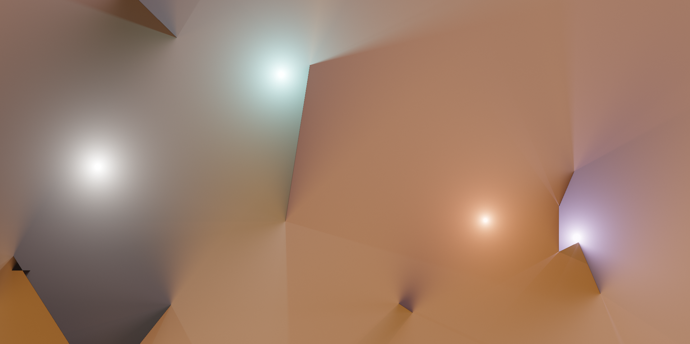
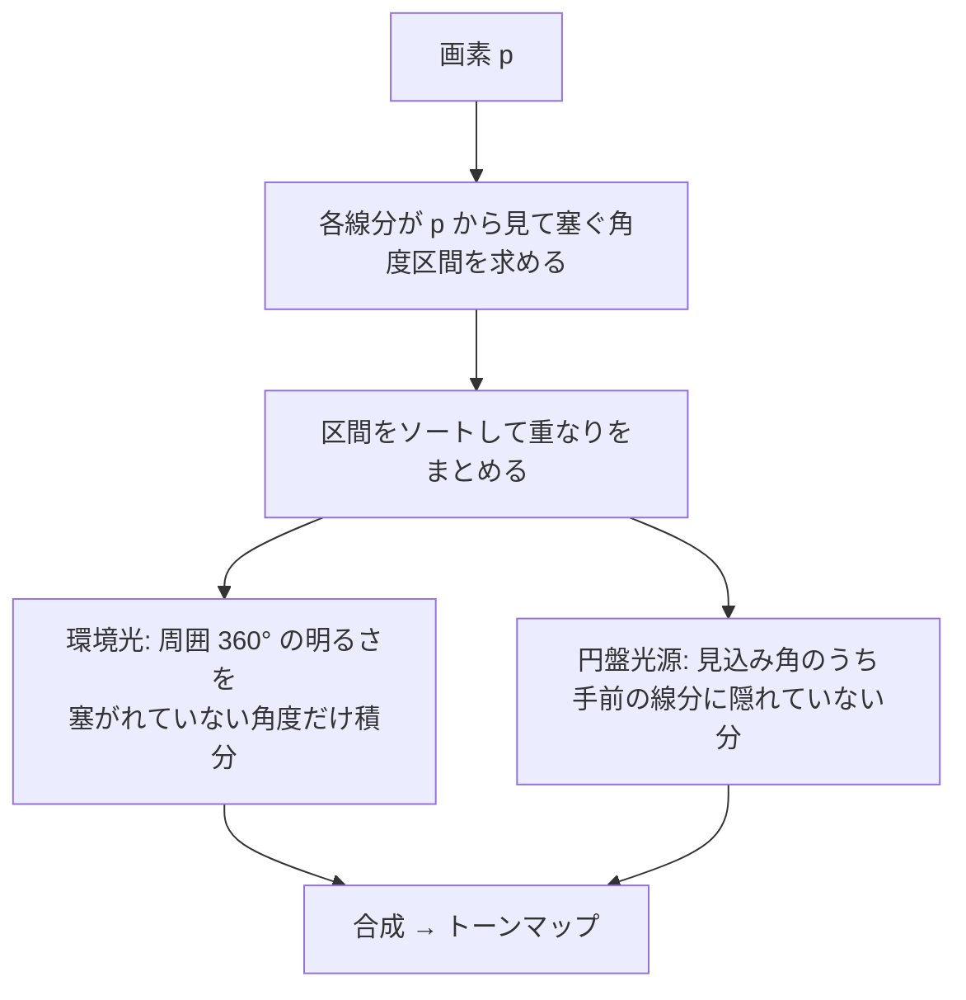

# Sketch_20260929

線分と光源だけでできた 2D ライティングのスケッチ。ノイズの無い、柔らかい影と扇状のグラデーションを WebGL2 でリアルタイムに描く。

**Demo:** https://sketch20260929.vercel.app

## 操作

| 入力 | 動作 |
|:--|:--|
| クリック | 新しいシーン（線分・光源・環境光をランダム生成） |
| マウス移動 | カーソル位置に白い光源 |
| G | GI（間接光）の ON/OFF |
| Space | 一時停止 |
| S | PNG 保存 |

URL パラメータ: `?seed=<数値>` でシーン固定、`?res=<0〜1>` で描画解像度を固定（省略時はフレーム時間に合わせて自動調整）、`?gi=1` で GI を有効化、`?albedo=<0〜1>` で壁の反射率（既定 0.5）。

## 仕組み

直接光は、レイマーチもサンプリングも使わず、各画素で見える角度を解析的に求める。

- 環境光は角度のフーリエ級数で表すので、区間の積分が閉じた式で求まる
- 線分の端点まわりでは塞がれる角度が連続的に変わるため、頂点から放射状のグラデーションが生じる
- 画素ごとに区間をソートするので、コストは線分数の 2 乗に比例する（上限は `renderer.js` の `MAX_SEGS`）

GI（既定では OFF）を有効にすると間接光を足す。

1. 各線分の両面に点を並べ、各点が受けた光 × 反射率を壁の明るさとする
2. 低解像度の画素から多数の光線を飛ばし、最初に当たった壁の明るさを平均して間接光とする
3. 壁の明るさには前フレームの間接光も含めるので、フレームを重ねるごとに多重反射へ収束する

## 構成

| ファイル | 役割 |
|:--|:--|
| `renderer.js` | WebGL2 のシェーダーと描画 |
| `scene.js` | シーンのランダム生成とアニメーション |
| `main.js` | ループ・入力・解像度の自動調整 |

ビルド不要。ES modules を使うのでローカルでは HTTP サーバー経由で開く（例: `python -m http.server`）。
